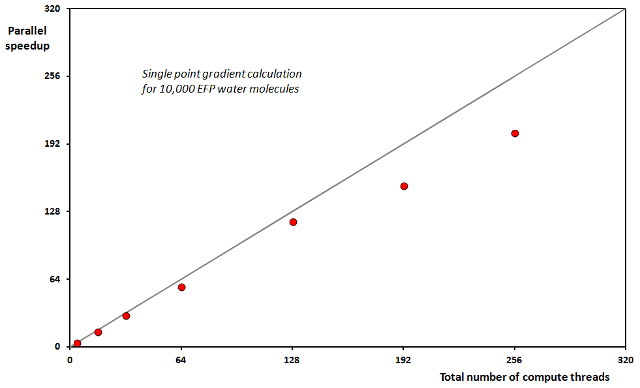

# LIBEFP

## Overview

The Effective Fragment Potential (EFP) method allows one to describe large
molecular systems by replacing chemically inert part of a system by a set of
Effective Fragments while performing regular _ab initio_ calculation on the
chemically active part [1-8]. The LIBEFP library is a full implementation of
the EFP method. It allows users to easily incorporate EFP support into their
favourite quantum chemistry package. 
LIBEFP is interfaced to [Q-Chem](http://www.q-chem.com) and
[PSI4](http://www.psicode.org) for QM/EFP calculations.

Detailed description of methods and algorithms can be found in two LIBEFP
papers:

- [Kaliman and Slipchenko, JCC 2013](http://dx.doi.org/10.1002/jcc.23375)
- [Kaliman and Slipchenko, JCC 2015](http://dx.doi.org/10.1002/jcc.23772)

## Getting source code

The latest release can be downloaded
[here](https://github.com/ilyak/libefp/releases).

## Installation

To build LIBEFP from source you need the following:

- C compiler (with C99 standard and OpenMP support)

- POSIX complaint make utility (BSD make or GNU make will work) or CMake

- BLAS/LAPACK libraries (required when linking with LIBEFP)

If you are going to compile EFPMD program (required for tests):

- Fortran 77 compiler

First, copy the configuration file which suits you from `config` directory to
the top source code directory. Rename the file to `config.inc` and edit it
according to your needs. All available options are explained in comments.
Defaults usually work well, but you may need to change the `MYLIBS` variable to
link with additional libraries required by your setup. You may also need to add
additional include directories to `MYCFLAGS` (using -I flag) or library search
path to `MYLDFLAGS` (using -L flag).

To compile issue:

    make

If you only need the library you can use:

    make libefp

To run the test suite (optional) issue:

    make check
    make checkomp    # to test OpenMP parallel code
    make checkmpi    # to test MPI parallel code

Finally, to install everything issue:

    make install

For CMake instructions, see [README-cmake.md](README-cmake.md).

## Documentation

The description of public LIBEFP API is available
[here](https://ilyak.github.io/libefp/doxygen_html/efp_8h.html).
Also see [this](interface/readme.txt) file for step-by-step instructions.
Fortran bindings to LIBEFP are available in
[interface/efp.f90](interface/efp.f90).

## EFPMD

The EFPMD program is a molecular simulation package based on LIBEFP.
It supports EFP-only molecular simulations such as geometry optimization
and molecular dynamics. EFPMD is a part of the LIBEFP distribution.
See [this](efpmd/README.md) file for more information.

## Parallel scaling

Parallel scaling of LIBEFP is shown below. Benchmarks were done on the
SDSC Gordon supercomputer using EFPMD.

## How to create custom EFP fragment types

LIBEFP comes with a library of ready-to-use fragments. If you decide to
generate custom fragment parameters follow the instructions below.

LIBEFP uses EFP potential files in format generated by GAMESS quantum
chemistry package (see http://www.msg.ameslab.gov/gamess/). A version of GAMESS
from August 11, 2011 is the currently a recommended and tested version. A set
of pre-generated library fragments are available in the `fraglib` directory. If
you want to generate parameters for custom fragments you should create GAMESS
makefp job input similar to the `fraglib/makefp.inp` file. Using this input
file as a template you can create EFP parameters for arbitrary fragment types.

After you created `.efp` file using GAMESS you should rename the fragment by
replacing `$FRAGNAME` with your name of choice (e.g. rename `$FRAGNAME` to
`$MYH2O`).

For a complete description of EFP data file format consult FRAGNAME section in
GAMESS manual (see http://www.msg.ameslab.gov/gamess/).

## Information for code contributors

- The main design principle for the LIBEFP library is Keep It Simple.
  All code should be easy to read and to understand. It should be easy to
  integrate the library into programs written in different programming
  languages. So the language of choice is C and no fancy Object-Oriented
  hierarchies.

- Be consistent in coding style when adding new code. Consistency is more
  important than particular coding style. Use descriptive names for variables
  and functions. The bigger the scope of the symbol the longer its name should
  be. Look at the sources and maintain similar style for new code.

- As with most quantum chemistry methods, EFP can require large amounts of
  memory. The guideline for developers here is simple: ALWAYS check for memory
  allocation errors in your code and return `EFP_RESULT_NO_MEMORY` on error.

- The code is reentrant which means that it is safe to use two different `efp`
  objects from two different threads. NEVER use mutable global state as it
  will break this. Store all mutable data in the `efp` object.

- Use `-Wall -Wextra -Werror` flags to make sure that compilation produces no
  warnings. Use `make check` to make sure that the code passes test cases.

## References

1. Fragmentation Methods: A Route to Accurate Calculations on Large Systems.
   M.S.Gordon, D.G.Fedorov, S.R.Pruitt, L.V.Slipchenko. Chem. Rev. 112, 632-672
   (2012).

2. Effective fragment method for modeling intermolecular hydrogen bonding
   effects on quantum mechanical calculations. J.H.Jensen, P.N.Day, M.S.Gordon,
   H.Basch, D.Cohen, D.R.Garmer, M.Krauss, W.J.Stevens in "Modeling the
   Hydrogen Bond" (D.A. Smith, ed.) ACS Symposium Series 569, 1994, pp
   139-151.

3. An effective fragment method for modeling solvent effects in quantum
   mechanical calculations. P.N.Day, J.H.Jensen, M.S.Gordon, S.P.Webb,
   W.J.Stevens, M.Krauss, D.Garmer, H.Basch, D.Cohen. J.Chem.Phys. 105,
   1968-1986 (1996).

4. Solvation of the Menshutkin Reaction: A Rigorous test of the Effective
   Fragment Model. S.P.Webb, M.S.Gordon. J.Phys.Chem.A 103, 1265-73 (1999).

5. The Effective Fragment Potential Method: a QM-based MM approach to modeling
   environmental effects in chemistry. M.S.Gordon, M.A.Freitag,
   P.Bandyopadhyay, J.H.Jensen, V.Kairys, W.J.Stevens. J.Phys.Chem.A 105,
   293-307 (2001).

6. The Effective Fragment Potential: a general method for predicting
   intermolecular interactions. M.S.Gordon, L.V.Slipchenko, H.Li, J.H.Jensen.
   Annual Reports in Computational Chemistry, Volume 3, pp 177-193 (2007).

7. Water-benzene interactions: An effective fragment potential and correlated
   quantum chemistry study. L.V.Slipchenko, M.S.Gordon. J.Phys.Chem.A 113,
   2092-2102 (2009).

8. Damping functions in the effective fragment potential method. L.V.Slipchenko,
   M.S.Gordon. Mol.Phys. 107, 999-1016 (2009).
